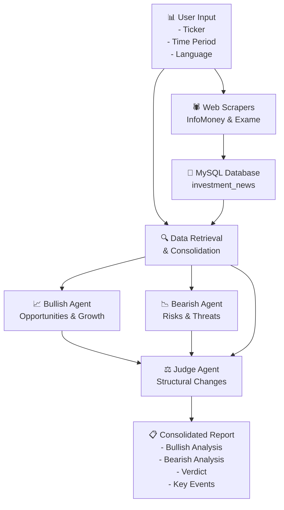

# NLP Agents Solution for Fundamental Analysis

## Overview

This document describes the architecture and functionality of an advanced Natural Language Processing (NLP) solution developed for automated fundamental analysis of companies listed on B3 (Brazilian stock exchange).

## System Architecture

## Key Features

| Criterion | Description |
| :--- | :--- |
| **System Objective** | Automate **fundamental analysis** of B3-listed companies, focusing on long-term "Buy & Hold" strategy. The system identifies **investment thesis breaks** and summarizes key events, providing three distinct perspectives to support decision-making: **Bullish**, **Bearish**, and **Neutral** (Judge). |
| **System Inputs & Database** | **Inputs:** Stock ticker (e.g., `PETR4`), time horizon (e.g., `12` months), and output language (Portuguese/English).  **Database:** MySQL database (`investment_news`).  **Data Used:** The system retrieves and consolidates **raw text** stored in the `processamento_texto` table, cross-referenced with the `noticias` table to filter relevant articles by `ticker_id` and `data_publicacao` within the specified time window. |
| **Agentic Flow & Models** | **Process Flow:** 1. **Data Collection:** Web scrapers (InfoMoney and Exame) capture recent news and store it in the database. 2. **Retrieval & Consolidation:** `AppController` retrieves all relevant text fragments from the database and unifies them into a single context. 3. **Multi-Agent Architecture:** `MultiAgentAnalysisService` orchestrates three LLM calls:    - *Bullish Agent:* Analyzes text for opportunities, competitive advantages, and growth potential.    - *Bearish Agent:* Analyzes text for risks, debt issues, and operational threats.    - *Judge Agent (Neutral):* Receives analyses from both agents plus raw news text. It evaluates whether a "structural thesis break" occurred (e.g., dilution, management change, fraud) based on strict criteria defined in the prompt.  **Language Model:** Uses **Google Gemini** (`gemini-2.0-flash-lite`) configured with temperature 0.7 to balance creativity and precision. |
| **Expected Outputs & Evaluation** | **Expected Outputs:** A consolidated Markdown report containing: 1. Detailed Bullish Perspective analysis. 2. Detailed Bearish Perspective analysis. 3. Fundamental Analysis verdict (Judge's Decision: YES/NO for structural changes). 4. Factual summary of major events.  **Evaluation Methodology:** Qualitative assessment conducted on specific scenarios where fundamental changes did (e.g., WEGE3 in 2025) and did not occur (e.g., CSAN3 in 2025). We verify the "Judge Agent's" ability to distinguish market noise (e.g., 5% stock decline) from fundamental events (e.g., capital increase, mergers, CEO changes) as implemented in the prompts. |

## Technical Stack

- **Language:** Python
- **Database:** MySQL
- **LLM Provider:** Google Gemini
- **Web Scraping:** BeautifulSoup
- **NLP Agents:** Multi-agent architecture with specialized prompts

## Getting Started

Refer to [DATABASE_SETUP.md](DATABASE_SETUP.md) for database configuration and [requirements.txt](requirements.txt) for dependencies.
